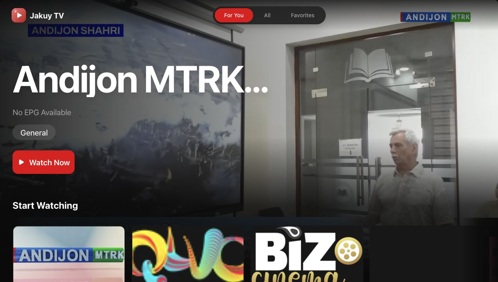
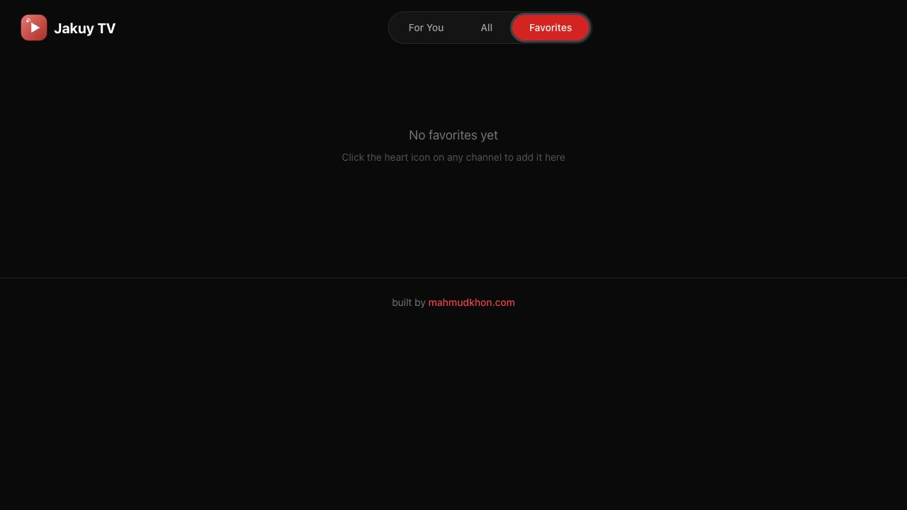

# Jakuy TV

Watch public Uzbek live TV channels in one clean interface.

Jakuy TV is a live TV web app for browsing and watching publicly available Uzbek IPTV
channels. It ingests public playlists, filters them down to Uzbek channels, and serves
them through a Java Spring Boot API and a custom Next.js frontend.

The project does not host or proxy video. It only indexes publicly available stream URLs.

## Architecture

```txt
Jakuy TV frontend (Next.js / React / TypeScript / Tailwind)
        |
        v
Spring Boot Java backend (Java 21, Spring Web, Spring Data JPA)
        |
        v
PostgreSQL database
        ^
        |
IPTV-org Uzbek channel ingestion (countries/uz.m3u, with index.m3u fallback)
```

- The backend downloads the iptv-org Uzbek playlist, parses the M3U in Java, filters to
  Uzbek channels, and upserts them into PostgreSQL.
- The frontend calls the backend REST API, maps the channel DTOs into its existing channel
  model, and plays streams directly in the browser with `hls.js`.

## Tech stack

| Layer     | Technology                                                        |
|-----------|-------------------------------------------------------------------|
| Frontend  | Next.js, React, TypeScript, Tailwind CSS, hls.js                   |
| Backend   | Java 21, Spring Boot 3.3, Spring Web, Spring Data JPA, validation  |
| Database  | PostgreSQL (H2 in-memory for the local `dev` profile)             |
| Infra     | Docker Compose                                                     |

## Features

- Browse Uzbek channels
- Search channels by name, tvg-id, category, or language
- Filter channels by category
- Play live streams in the browser
- Save favorite channels (synced to the backend)
- See online/offline stream status
- Fullscreen TV mode and channel switching
- Uzbek-only: channels from other countries are never shown

## Repository structure

```txt
Jakuy/
  frontend/            Jakuy TV Next.js app
  backend/             Spring Boot backend (com.jakuy.tv)
  docker-compose.yml
  README.md
```

## Setup

### Option A: Docker Compose (Postgres + backend + frontend)

```bash
docker compose up --build
# Frontend: http://localhost:3000
# Backend:  http://localhost:8080
```

After the stack is up, import the Uzbek channels once:

```bash
curl -X POST http://localhost:8080/api/import/uzbek-channels
```

### Option B: Run locally without Docker

Backend (uses an in-memory H2 database via the default `dev` profile, no Postgres needed):

```bash
cd backend
mvn spring-boot:run
curl -X POST http://localhost:8080/api/import/uzbek-channels
```

To run the backend against a local PostgreSQL instead:

```bash
cd backend
SPRING_PROFILES_ACTIVE=postgres \
SPRING_DATASOURCE_URL=jdbc:postgresql://localhost:5432/jakuy_tv \
SPRING_DATASOURCE_USERNAME=jakuy \
SPRING_DATASOURCE_PASSWORD=jakuy_password \
mvn spring-boot:run
```

Frontend:

```bash
cd frontend
cp .env.example .env.local   # already provided
npm install
npm run dev                  # http://localhost:3000
```

The frontend loads Uzbek channels from the backend automatically on startup. If no channels
appear, run the import command above.

## Environment variables

### Frontend (`frontend/.env.local`)

```env
NEXT_PUBLIC_API_URL=http://localhost:8080
NEXT_PUBLIC_APP_NAME=Jakuy TV
```

### Backend

| Variable                     | Default                                          | Description                       |
|------------------------------|--------------------------------------------------|-----------------------------------|
| `SPRING_PROFILES_ACTIVE`     | `dev`                                            | `dev` (H2) or `postgres`          |
| `SPRING_DATASOURCE_URL`      | `jdbc:postgresql://localhost:5432/jakuy_tv`      | Postgres JDBC URL (postgres only) |
| `SPRING_DATASOURCE_USERNAME` | `jakuy`                                          | Postgres user                     |
| `SPRING_DATASOURCE_PASSWORD` | `jakuy_password`                                 | Postgres password                 |
| `jakuy.cors.allowed-origins` | `http://localhost:3000,http://localhost:3001`    | Allowed frontend origins          |

## API endpoints

| Method | Path                            | Description                                    |
|--------|---------------------------------|------------------------------------------------|
| GET    | `/api/channels`                 | Paginated Uzbek channels (`category`, `online`, `page`, `size`) |
| GET    | `/api/channels/{id}`            | Single channel                                 |
| GET    | `/api/channels/search?q=`       | Search by name, tvg-id, category, language     |
| GET    | `/api/channels/categories`      | Distinct categories                            |
| GET    | `/api/channels/online`          | Channels currently marked online               |
| GET    | `/api/channels/{id}/stream`     | Stream URL + online status for a channel       |
| POST   | `/api/import/uzbek-channels`    | Import/refresh Uzbek channels from iptv-org    |
| GET    | `/api/favorites`                | List favorites                                 |
| POST   | `/api/favorites/{channelId}`    | Add a favorite                                 |
| DELETE | `/api/favorites/{channelId}`    | Remove a favorite                              |
| POST   | `/api/streams/check`            | Health-check a batch of streams                |

All `/api/channels` responses are Uzbek-only. Country values supplied by a client are
ignored; the backend always restricts results to `countryCode = UZ`. Results are paginated;
the maximum page size is capped server-side.

Example channel response:

```json
{
  "id": 1,
  "tvgId": "Uzbekistan24.uz",
  "name": "Uzbekistan 24",
  "country": "Uzbekistan",
  "countryCode": "UZ",
  "language": "Uzbek",
  "category": "News",
  "logoUrl": "https://example.com/logo.png",
  "streamUrl": "https://example.com/live.m3u8",
  "online": true,
  "lastCheckedAt": "2026-06-14T18:00:00Z"
}
```

Example stream-check request (max 50 channels per request):

```bash
curl -X POST http://localhost:8080/api/streams/check \
  -H 'Content-Type: application/json' \
  -d '{"limit": 50}'          # or {"channelIds": [1,2,3]}
```

## How IPTV-org Uzbek channel data is used

Jakuy TV reimplements the IPTV ingestion in Java rather than reusing the iptv-org tooling.

1. The importer downloads `https://iptv-org.github.io/iptv/countries/uz.m3u`.
2. A Java `M3uParser` parses each `#EXTINF` entry, extracting `tvg-id`, `tvg-name`,
   `tvg-logo`, `group-title`, the display name after the comma, and the stream URL.
   Invalid or malformed lines are skipped without aborting the import.
3. Channels are saved as Uzbek (`country = Uzbekistan`, `countryCode = UZ`,
   `language = Uzbek`). Existing channels are updated in place; duplicates are avoided by
   matching on `tvgId` first, then `streamUrl`.
4. If the Uzbek playlist is unavailable or empty, the importer falls back to the global
   `index.m3u` and keeps only channels whose `tvg-id` identifies them as Uzbek (`.uz`).

Import result example:

```json
{ "imported": 25, "updated": 10, "skipped": 3, "totalParsed": 38, "source": "https://iptv-org.github.io/iptv/countries/uz.m3u" }
```

## Legal disclaimer

Jakuy TV does not host, own, or control any video streams.
The app indexes publicly available Uzbek IPTV stream URLs for educational and demonstration purposes.
All content belongs to its respective owners.
Streams can be removed on request.

## Screenshots

### Browse Uzbek channels



### Watch live TV


### Save favorite channels



## Roadmap

- Scheduled background stream-health checks
- Redis caching for channel and category responses
- Per-user accounts and authenticated favorites
- Electronic program guide (EPG) integration
- Optional CDN/proxy fallback for CORS-restricted streams

## Known limitations

- Favorites are global (no authentication or per-user separation) for the MVP.
- Stream health checks are on-demand and batched (default 50 per request); there is no
  scheduler yet.
- Online/offline status reflects the last manual check, not real-time availability.
- Some public streams may be geo-restricted or intermittently offline.
